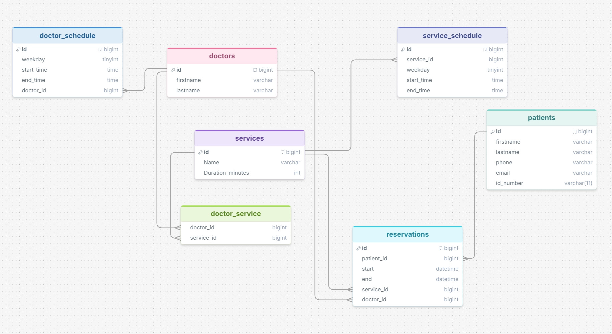

# Todua Booking Engine

Laravel API for doctor reservation management.

## Table of Contents

* [Pre-requisites](#pre-requisites)
* [Installation](#installation)
* [Database Setup](#database-setup)
* [Database Schema](#database-schema)
* [Testing](#testing)
* [API Endpoint](#api-endpoint)
* [Postman Collection](#postman-collection)
* [Possible Improvements](#possible-improvements)
* [Notes](#notes)

## Pre-requisites

This project requires PHP 8.3 or higher and MySQL 8.0 or higher.

## Installation

Run standard [Laravel installation](https://laravel.com/docs/13.x/installation) procedures.

Make sure you have installed all dependencies:

```bash
composer install
```

You can install all services separately, but for Local Setup I would recommend using
[Laravel Herd](https://herd.laravel.com/)
and for Database [DBngin](https://dbngin.com/)

(Because Laravel Herd free version does not include DB)

Example local URL used for this project:

```text
https://todua-booking-engine.test
```

## Database Setup

Run migrations and seeders:

```bash
php artisan migrate:fresh --seed
```

This will create doctors, patients, services, schedules, doctor-service relations, reservations, and related test data.

## Database Schema

Database schema representation is included below:


## Testing

After seeding initial data run pest to run Reservation tests
```bash
php artisan test --filter=ReservationTest
```


Reservation tests cover:

* successful reservation creation
* doctor-service validation
* doctor working-hours validation
* service schedule validation
* overlapping reservation prevention
* past-date validation
* phone validation and normalization

## API Endpoint

Main endpoint:

```http
POST /api/reservations
```

## Postman Collection

A [Postman Collection](postman/Todua%20Reservation%20API.postman_collection.json) is included in the project for testing the reservation API.

The Postman collection uses a `base_url` variable.
Make sure it points to your local project URL.

by default it is set to:
```text
https://todua-booking-engine.test
```
## Possible Improvements

In a production system, database transactions and locking could be added to prevent double-booking when multiple users reserve the same time at once.

## Notes

If we send a request with an ID that already exists in our Database, but with different name for example, it will be updated, because ID is unique. not sure about business logic behind, so leaving it as it is. otherwise would probably use firstOrCreate();
